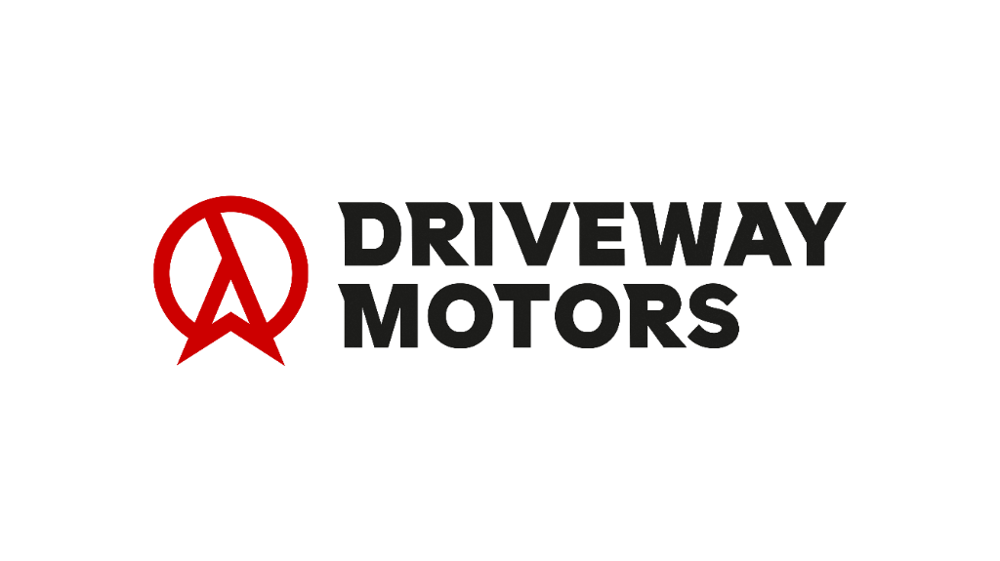

# Driveway Motors - Car Rental Management System

A modern, comprehensive dashboard for managing a car rental business. Built with **React**, **Vite**, and **Firebase**, it handles everything from inventory and customers to financials and complex rental logic.



## 🚀 Key Features

### 📊 Interactive Dashboard
- Real-time overview of **Monthly Revenue**, **Active Rentals**, and **Total Customers**.
- Visual diagrams (Bar Charts) for revenue trends over week, month, and year.
- "Recent Sales" feed and "Top Performing Cars" metrics.

### 🚗 Fleet Management
- **Inventory Control**: Add, edit, and delete vehicles.
- **Status Tracking**: Automatically tracks vehicle status (Available, Rented, On Maintenance).
- **Maintenance Logs**: Track service history and automatically block rentals during maintenance periods.

### 👥 Customer & Dealer CRM
- **Detailed Profiles**: Store personal info, documents (Aadhaar, DL, Proofs), and contact details.
- **Financial Ledger**: Individual financial history for every customer and dealer (Credits vs Debits).
- **Smart Validation**: Unique phone number enforcement and auto-generated IDs (`CUST-XXXX`, `DLR-XXXX`).

### 📝 Rental Operations
- **Booking Engine**: Create rentals with automatic conflict detection (prevents overlapping dates for the same car).
- **Dynamic Pricing**: Automatic calculation based on daily rates with special **10-day** and **30-day** discount logic.
- **Billing**: Generate detailed price breakdowns including standard and discounted rates.

### 🔐 Security & Authentication
- **Secure Access**: Full Email/Password login system protected by **Firebase Auth**.
- **Identity Verification**: Integrated **SMS OTP Verification** (via Firebase Phone Auth) during signup.
- **Route Protection**: Private routing ensures only authenticated users can access the system.

## 🛠️ Tech Stack

- **Frontend**: React.js (Vite), JavaScript
- **Styling**: Tailwind CSS, Shadcn-like UI components
- **Backend / Database**: Firebase Realtime Database
- **Authentication**: Firebase Auth (Email + Phone/SMS)
- **Icons**: Lucide React
- **Charts**: Recharts

## ⚙️ Installation & Setup

1.  **Clone the repository**
    ```bash
    git clone https://github.com/yourusername/driveway-motors.git
    cd driveway-motors
    ```

2.  **Install Dependencies**
    ```bash
    npm install
    ```

3.  **Environment Setup**
    - Create a firebase project at [console.firebase.google.com](https://console.firebase.google.com).
    - Enable **Email/Password** and **Phone** authentication providers.
    - Create a Realtime Database.
    - Update `src/lib/firebase.js` with your config keys.

4.  **Run Locally**
    ```bash
    npm run dev
    ```

5.  **Build for Production**
    ```bash
    npm run build
    ```

## 📄 License
This project is licensed under the MIT License.
